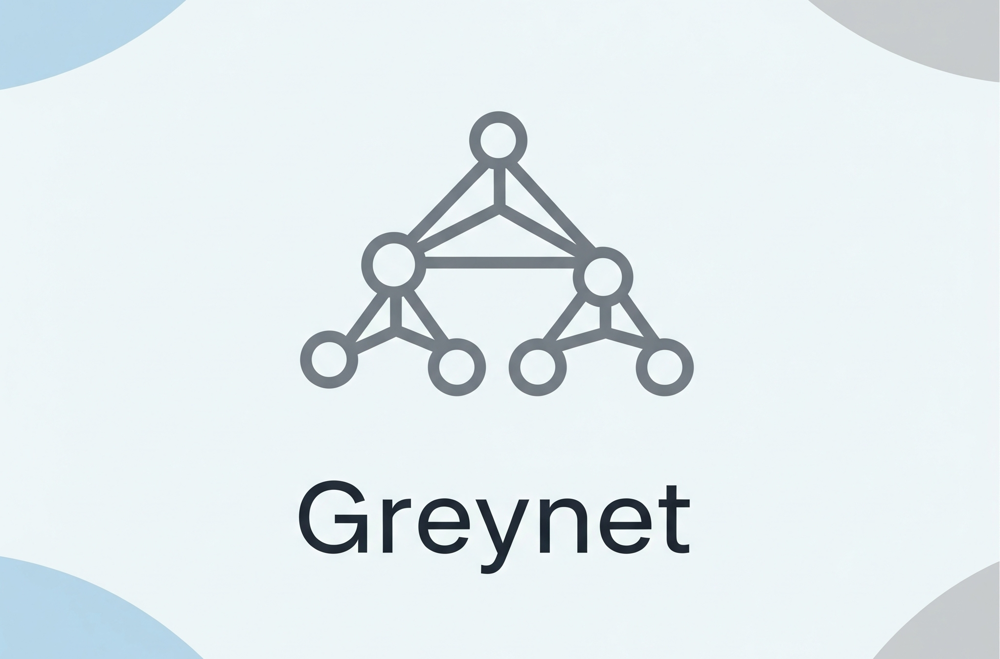

Greynet Constraint Satisfaction Engine
======================================

**Greynet** is a high-performance, embeddable constraint satisfaction engine for Rust, inspired by the principles of the Rete algorithm. It is designed for complex scheduling, planning, and resource allocation problems where solutions must adhere to a set of weighted, and often conflicting, constraints.

The engine provides a powerful and expressive fluent API to define the problem space.
Core Features
-------------

* **Fluent Constraint Builder**: Define complex rules and relationships using a chained, easy-to-read API.

* **Flexible Scoring**: Supports multiple score types out-of-the-box (`SimpleScore`, `HardSoftScore`, `HardMediumSoftScore`) to model various levels of constraint priority.

* **High-Performance Internals**:
  
  * **Zero-Copy Operations**: Functions for filtering, joining, and scoring operate directly on tuple data without intermediate allocations.
  
  * **Efficient Indexing**: Utilizes specialized data structures (`UniIndex`, `AdvancedIndex`) for fast tuple lookups.
  
  * **Memory Safety**: Employs a generational arena (`slotmap`) for tuple and node storage, preventing memory leaks and use-after-free errors.

* **Batch Scheduler**: A high-throughput scheduler processes insertions and retractions in batches, efficiently propagating changes through the network until it reaches a stable state.

* **Rich Collectors**: Provides a suite of aggregation functions (`count`, `sum`, `avg`, `toList`, `toSet`, etc.) for use in `groupBy` operations.

* **Resource Management**: Allows setting explicit limits on memory, tuple count, and operation depth to ensure stability in resource-constrained environments.
